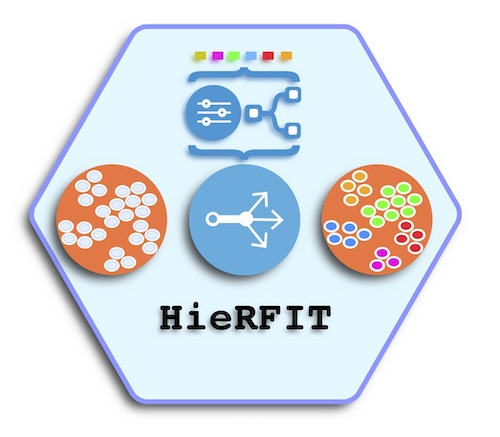

# HieRFIT
## Hierarchical Random Forest for Information Transfer

One of the applications can be determining major cell types of samples in the single cell RNAseq (scRNAseq) datasets. Common methods for deciding type of the cells often involve manually checking known tissue/cell specific gene expression levels. Sensitive methods for automatically determining cell types is currently lacking. Therefore, our effort is to develop a machine learning approach to predict cell labels using gene expression levels from scRNAseq datasets. This will allow researchers to find out existing cell types in their experimental outcomes and use these predictions to further fine tune their data for downstream analysis, such as marker gene selection, differential expression test, etc.
