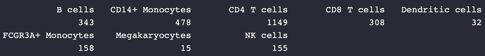
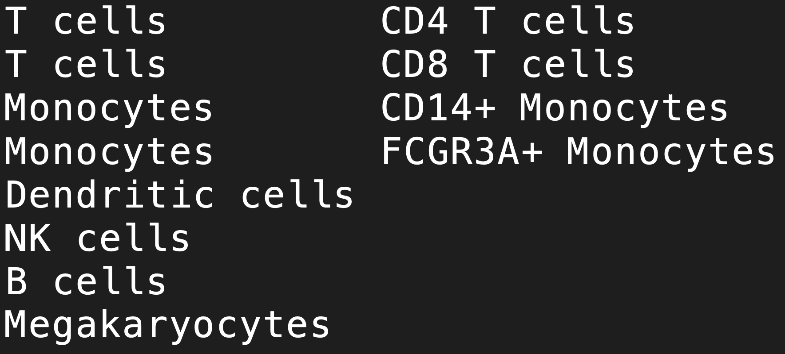
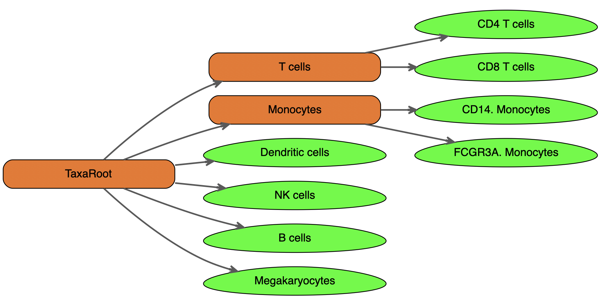
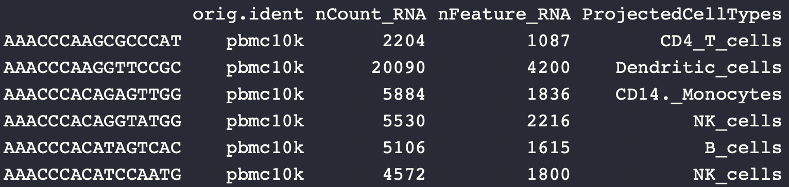
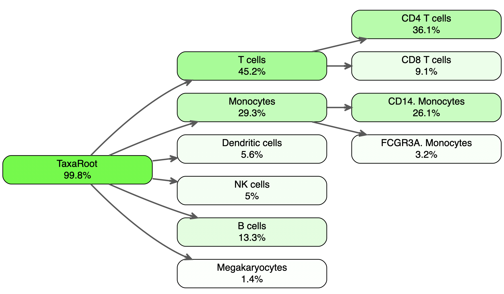

# HieRFIT
## Hierarchical Random Forest for Information Transfer


Increasing demand for data integration and cross-comparison in bioinformatics drive the need for new methods. One of the applications of this R package is determining major cell types of samples in the single cell RNAseq (scRNAseq) datasets. Common methods for deciding type of the cells often involve manually checking known tissue/cell specific gene expression levels. Sensitive methods for automatically determining cell types is currently lacking. Therefore, our effort is to develop a machine learning approach to predict cell labels using gene expression levels from scRNAseq datasets. This will allow researchers to find out existing cell types in their experimental outcomes and use these predictions to further fine tune their data for downstream analysis, such as marker gene selection, differential expression test, etc.

## How to install

```
install.packages("devtools")

library(devtools)

install_github("yasinkaymaz/HieRFIT")

library(HieRFIT)
```


### Quick tutorial

The goal is to project cell type information from an existing experiment to our new experiment. We wonder whether our experiment went well and recovered a diverse cell population or not. Let's say our data is a new PBMC scRNAseq data.

We pretend that our data is this another PBMC run from 10X Genomics:
[Test set data is from 10X Genomics](http://cf.10xgenomics.com/samples/cell-exp/3.0.0/pbmc_10k_v3/pbmc_10k_v3_filtered_feature_bc_matrix.tar.gz)
Note: Please, unzip all files and rename features.tsv as genes.tsv!


To use as a reference, get the data [PBMC single cell RNAseq data with 2,700 cell](https://www.dropbox.com/s/kwd3kcxkmpzqg6w/pbmc3k_final.rds?dl=0). The final data is in Seurat object format and processed by following the [tutorial](https://satijalab.org/seurat/pbmc3k_tutorial.html)


```{r}
library(Seurat)
# Process the data:
new.pbmc.data <- Read10X("pbmc_10k_v3/filtered_feature_bc_matrix/")

#This is the basic 10X data processing with Seurat (version 3).
newPBMC <- CreateSeuratObject(counts = new.pbmc.data, project = "pbmc10k", min.cells = 3, min.features = 200)
newPBMC <- NormalizeData(newPBMC)

```


Load the reference data
```{r}
pbmc <- get(load("pbmc3k_final.Rda"))

#You need to update it to the new Seurat format if necessary:
pbmc <- UpdateSeuratObject(pbmc)
```
<br/>
The reference data has the metadata for cell type assignments:

```{r}
table(pbmc@meta.data$ClusterNames_0.6)
```


<br/>

```{r}
# A tree file for cell type hierarchy:
treeTable <- read.delim("pbmc3k_taxa.txt", header = F)
```

This tree file is a custom organization of cell types in the reference dataset. A tab separated file with columns storing the subnode of each ancestor type (if exist) as below:




<br/>
```{r}
#if you want to visualize how the topology looks like:
source("https://raw.githubusercontent.com/yasinkaymaz/HieRFIT/master/data/extra/ploting_functions.R")
PlotTopo(treeTable = treeTable)
```

{ width=50% }
<br/>
Then, create the reference model using the cell class labels. Here, we can use a topology tree for defining relationship between the cell groups ("pbmc3k_tree").

```{r}
library(HieRFIT)

refmod <- CreateHieR(RefData = as.matrix(pbmc[["RNA"]]@data),
                     ClassLabels = pbmc@meta.data$ClusterNames_0.6,
                     TreeTable = treeTable)

#After creating the model, you can save it for later use:
SaveHieRMod(refMod = refmod, fileName = "PBMC3K_HierMod")

#Project the cell class labels on the new dataset:
ProObj <- HieRFIT(Query = as.matrix(newPBMC[["RNA"]]@data), refMod = refmod)

newPBMC@meta.data$ProjectedCellTypes <- ProObj@Evaluation$Projection

```

meta.data slot of the object will now store all the final cell type prediction in the column "ProjectedCellTypes".
```{r}
head(newPBMC@meta.data)
```

{width=%35}
<br/>
Also, you can visualize the cell type projection results in percent distributions on the classification tree defined above:
```{r}
PlotTopoStats(treeTable = treeTable, Projections = newPBMC@meta.data$ProjectedCellTypes)
```

{width=%35}
<br/>


### How it works:

1. Feature/predictor selection from significant principal components (PCA),
2. Build a hierarchical decision tree,
3. Create local classifiers at each node,
3. Combine local classifiers into a reference model,
4. HieRFIT new data using reference.


## Projecting cell types inter-species

HieRFIT can take an argument "xSpecies" for inter-species cross projection of cell types. In this example below, we demonstrate how to use a HieR model, "refmodZr4" build on mouse brain single cell atlas to project cell type labels on to a rat single cell data. Using biomaRt package, we find the orthologous genes between two species.

```{r}
hippo006.HierObj <- HieRFIT(Query = as.matrix(hippo006[["RNA"]]@data), refMod = refmodZr4, xSpecies = "mouse2rat")
```
This command above also creates a dataframe called "ortoDict" and saves it in the global environment. This table can be fed into other HieRFIT runs using "ortoDict" argument, if same xSpecies is the case, to save time as follows:

```{r}
hippo006.HierObj <- HieRFIT(Query = as.matrix(hippo006[["RNA"]]@data),
                            refMod = refmodZr4,
                            xSpecies = "mouse2rat",
                            ortoDict = ortoDict)
```
