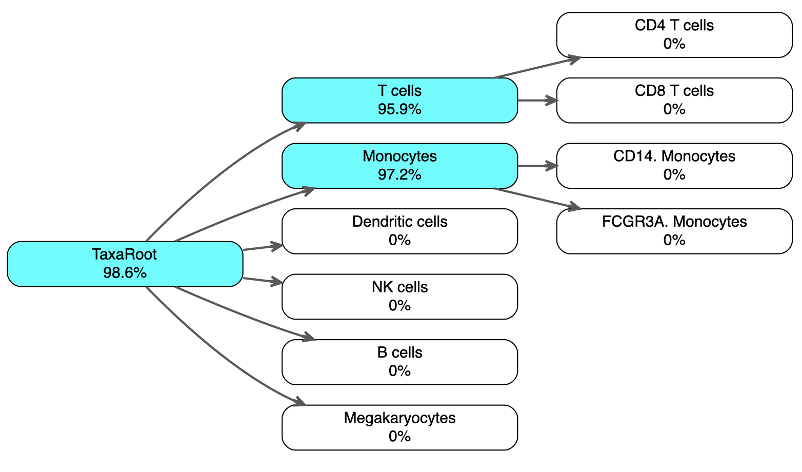
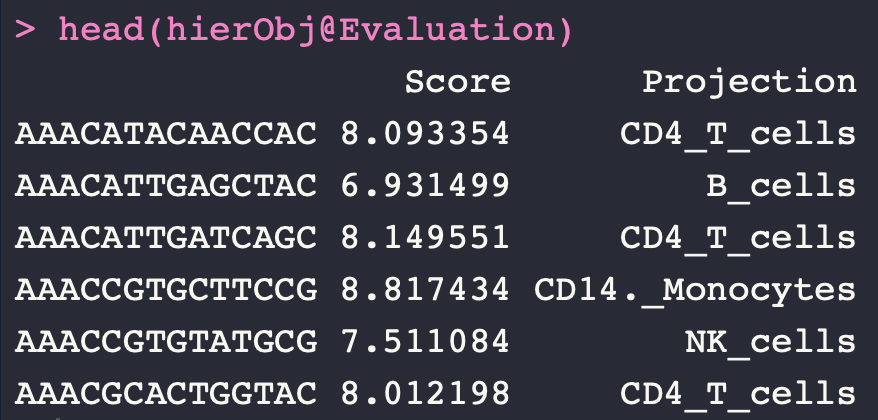
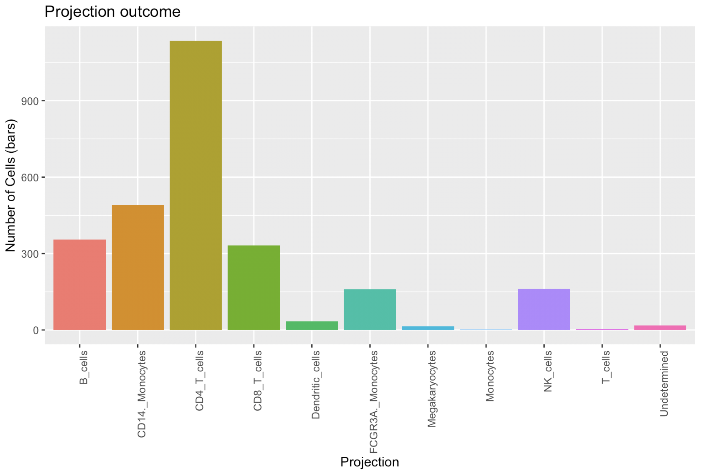
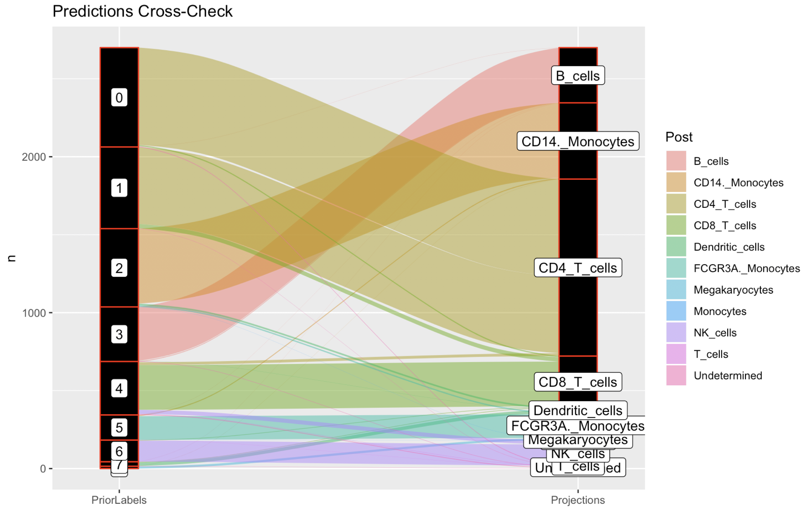

# HieRFIT
## Hierarchical Random Forest for Information Transfer


There is an increasing demand for data integration and cross-comparison in the single cell genomics field. The goal of this R package is to help users to determine major cell types of samples in the single cell RNAseq (scRNAseq) datasets. Common methods for deciding the type of the cells often involve checking known tissue/cell specific gene expression levels manually. Existing machine learning approaches work in a flat classification manner in which cell class labels are treated equally and no intermediate stages/types are considered. Here, with HieRFIT, we allow users to rearrange the reference cell types in a hierarchical organization and provide meaningfull intermediate cell types when annotating new datasets. Depending on the assignment confidence, HieRFIT projects cell type as well as intermediate node labels from the reference model to a query data. 

## How to install

Using the 'devtools' package, you can simply install:
```
install.packages("devtools")

devtools::install_github("yasinkaymaz/HieRFIT")

library(HieRFIT)

Note: Installing additional R packages are recommended: DiagrammeR, e1071, alluvial, and ggalluvial
```

### Quick tutorial

The goal is to project cell type information from an existing experiment to our new experiment. 

In this tutorial, we will be using Seurat version 3 for convenient data processing although it is not a dependency for HieRFIT. A normalized expression matrix (genes in rows and cells in columns) processed by any pipeline would work for our purpose.

First of all, we need to generate the reference model.
<br/>
<br/>

#### Constructing the Reference model:

We are going to use a PBMC dataset with already labeled cell types as the reference data. Here is the [PBMC single cell RNAseq data with 2,700 cell](https://www.dropbox.com/s/kwd3kcxkmpzqg6w/pbmc3k_final.rds?dl=0). The final data is already in Seurat format and processed by following the [tutorial from Satija lab.](https://satijalab.org/seurat/pbmc3k_tutorial.html)

Load the reference data and update:
```{r}
library(Seurat)
pbmc <- readRDS("pbmc3k_final.Rds")

#You need to update it to the new Seurat format:
pbmc <- UpdateSeuratObject(pbmc)
```

The reference data has the metadata for cell type assignments in the column 'ClusterNames_0.6'. This command will show the frequency of cell types in the data:

```{r}
table(pbmc@meta.data$ClusterNames_0.6)
```


<br/>
<br/>

#### A tree file for cell type hierarchy:

The user can provide a tree file storing a custom (biologically meaningfull) organization of cell types in the reference dataset. In this tab separated file, each row leads to a cell type in the reference optionally put together under an ancestor type as below. For this example, we create two broader cell type classes, "T cells" which will be the parent of "CD4 T cells" and "CD8 T cells" and secondly "Monocytes" as the parent of "CD14+ Monocytes" and "FCGR3A+ Monocytes". This example tree file appears like below:


<br/>

_Important!_ You have to make sure that the rows of the tree tab file correspond to the cell types in the reference data above (or at least a subset of them) and each row ends with a cell type label present in the reference. The intermediate cell labels, i.e. "Monocytes", can be anything that would make sense to the user.

Simply, read the tree file: 
```{r}
treeTable <- read.delim("pbmc3k_taxa.txt", header = F)
```

Visualize the tree topology by using the function below and make sure everything looks as you anticipated:
```{r}
PlotTopoTree(obj = treeTable)
```

<br/>

_Note:_ Although, user can provide a meaningfull cell type tree like the example above, it is not a requirement for model construction as HieRFIT can generate a de novo tree by assessing the transcriptional similarities between the cell types. In that case, intermediate cell labels will be 'Int.Node.1', 'Int.Node.2', etc.

<br/>

#### Generate the model:

Now, we are ready to create the reference model using the cell class labels and the tree topology which we defined above out of reference cell types. This function will take the normalized gene expression matrix (genes in rows and cells in columns) and the corresponding cell types as input along with the tree table. It is also important to provide the proper species name of the reference data (default is "hsapiens") to be able obtain appropriate results especially in case of cross-species projections (alternatives are for example; 'mmusculus', or 'rnorvegicus' for mouse or rat, respectively; or any other species).

Be aware that, depending on the reference data size and complexity of the tree topology, this process takes a while. It will create an S4 object at the end and will store everthing you would need for hierarchical classification in various slots.

```{r}
refmod <- CreateHieR(RefData = pbmc[["RNA"]]@data,
                     ClassLabels = pbmc@meta.data$ClusterNames_0.6,
                     Tree = treeTable,
                     species = "hsapiens")
```

After generating the model, you can save it for later use. This will create a file with .RDS extention in the working directory (i.e. 'PBMC3K_HierMod.RDS'):

```{r}
SaveHieRMod(refMod = refmod, filePrefix = "PBMC3K_HierMod")

```
If you desire to check the classification accuracy of the model, you can plot the percent out of bag accuracy estimations projected on each node of the classification tree as below:

```{r}
PlotTopoNodeAcc(refMod = refmod)
```



Please, note that only internal nodes are assessed for accuracy and this metric does not apply to leaf nodes (therefore they are all 0%).

<br/>

#### Projecting the reference cell type on to a query dataset:

Now, we can start using our model to annotate new query datasets. Our example query is a new [PBMC scRNAseq data from 10X Genomics.](http://cf.10xgenomics.com/samples/cell-exp/3.0.0/pbmc_10k_v3/pbmc_10k_v3_filtered_feature_bc_matrix.tar.gz) After downloading, please, unzip all files and rename 'features.tsv' as 'genes.tsv'!

```{r}
#Using the Seurat functions, prepare the data:
new.pbmc.data <- Read10X("pbmc_10k_v3/filtered_feature_bc_matrix/")

newPBMC <- CreateSeuratObject(counts = new.pbmc.data, project = "pbmc10k", min.cells = 3, min.features = 200)

newPBMC <- NormalizeData(newPBMC)
```

In case you are loading a previously saved model, please use the 'readRDS' function to load it. To project the reference cell types, simply, feed the _HieRFIT_ function with the reference model 'refmod' and the query's normalized expression data:

```{r}
#if you are using a pre-trained model:
refmod <- readRDS("PBMC3K_HierMod.RDS")

#Project the cell class labels on the new dataset:
hierObj <- HieRFIT(Query = newPBMC[["RNA"]]@data, refMod = refmod)
```
'hierObj' is an S4 object that stores all the metrics used in various slots but the most relevant one is called 'Evaluation'. This data frame has two columns for Scores of each assignment and the projected cell type.


<br/>
<br/>

#### Exploring the projection results:

To summarize the results, simply utilize the following functions below. Note that, some of the cells have been labeled with intermediate cell types, for instance; "T_cells" or "Monocytes", while some were "Undetermined".

```{r}
PlotBarStats(HieRobj = hierObj)
```

<br/>

Also, you can visualize the cell type projection results in percent distributions on the classification tree. The values are cummulative as each represents the sum of its children nodes plus itself. Percent value of the "TaxaRoot" shows sum of all cell type assignment rates except "Undetermined" class.

```{r}
PlotTopoStats(HieRobj = hierObj)
```


<br/>

If a cross comparison is desired between any of the prior cell information from the query dataset and the projections, the 'CrossCheck' function can be utilizes as follows. For example, we want to cross compare the Seurat cluster ids with the projection results:

```{r}
CrossCheck(HieRobj = hierObj, Prior = newPBMC@meta.data$res.1)
```


<br/>


### Projecting inter-species cell types

HieRFIT takes an argument "QSpecies" for cross-species projection of cell types. Its default is 'null' and assumes that the query is from a same species as the model. Thus, it is important to provide the proper species to the functions, otherwise, meaningless results will emerge. In case of projecting model cell types to a different species, user can use this argument.

In this example below, we demonstrate how to use a pretrained HieRmod, "refmodMouse", which was generated with mouse brain single cell RNAseq data to project cell type labels on to a rat single cell data. 

Using biomaRt package, HieRFIT finds the orthologous genes between two species and use them to classify query cells.

```{r}
hierObjRat <- HieRFIT(Query = Ratdata[["RNA"]]@data, refMod = refmodMouse, Qspecies = "mmusculus")
```
This command above also creates a data frame called "ortoDict" and saves it in the R global environment. To save running time, this table can be fed into other HieRFIT runs using "ortoDict" argument, if the same analysis needs to be repeated:

```{r}
hierObjRat <- HieRFIT(Query = Ratdata[["RNA"]]@data,
                            refMod = refmodMouse,
                            Qspecies = "mmusculus",
                            ortoDict = ortoDict)
```

### How it works:

Manuscript is in preparation.

1. Feature/predictor selection from significant principal components (PCA),
2. Build a hierarchical decision tree,
3. Create local classifiers at each node,
3. Combine local classifiers into a reference model,
4. HieRFIT new data using reference.

